# windows10环境准备
## 安装node.js
官网下载node.js
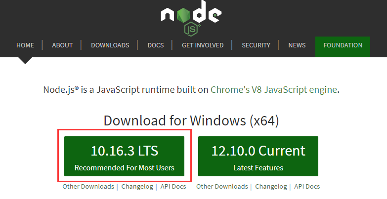

安装时正常next就行,
然后进入cmd命令模式
输入node -v,看到有版本号则说明安装成功
## 安装vue
### vue3.0 安装
npm install -g @vue/cli

安装完后cmd输入vue -V可以看到vue的版本,说明安装成功

## 安装vscode
使用vscode作为编辑工具
# 项目创建
在桌面新建一个vueTest文件夹,然后用vscode打开该文件夹
打开vscode的终端

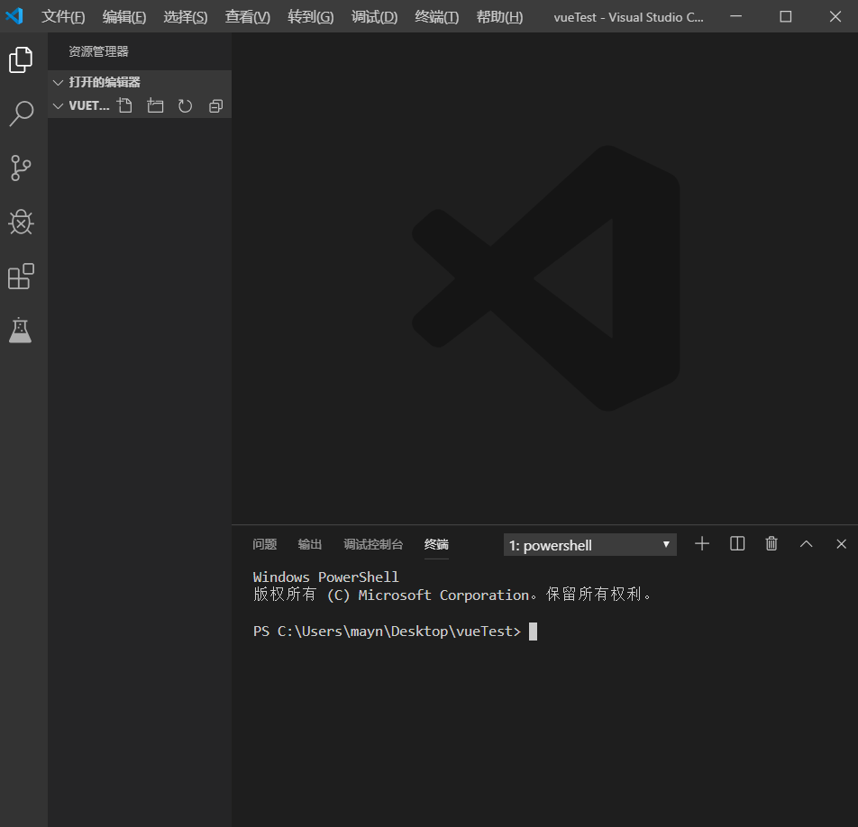

输入vue create my-vue
然后显示这个页面,如果第一次创建需要选择一个是否使用taobao,选择Y就行

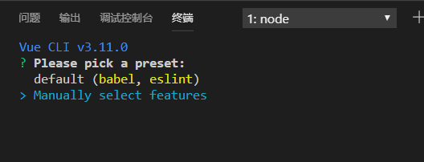

方向键向上下移动,空格选择,回车确认

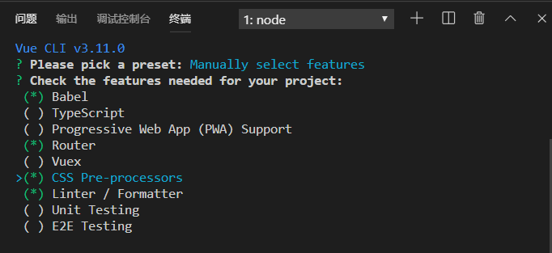

选择Y

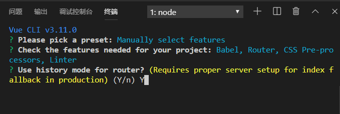

选择css的预编译,选择Less

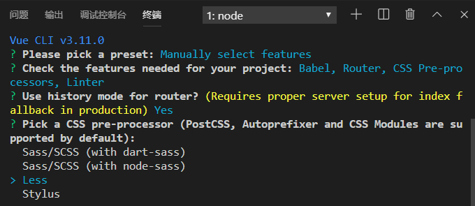
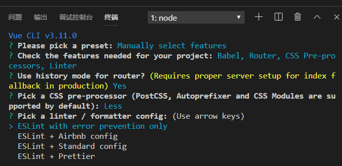
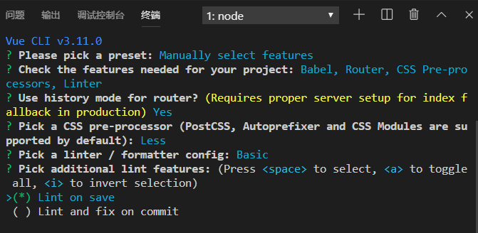
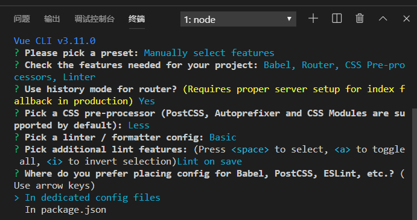

然后进入下一个页面问你是否保存当前配置,如果选择Y的话,下一次再创建的时候就不用在配置刚刚这些步骤了,我这里选择N

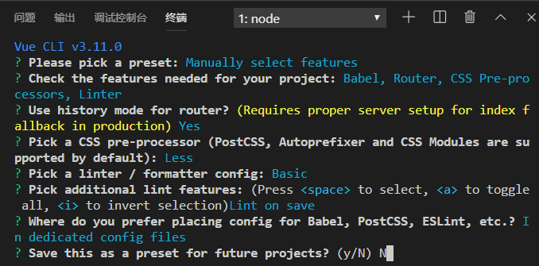

然后等待项目创建,如果要选择yarn或NPM哪个下载依赖,选择npm,没有则跳过

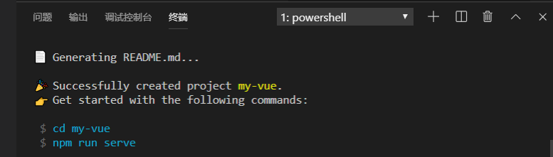

出现这个则说明项目创建完毕

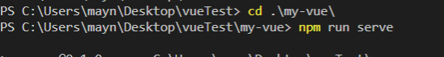

输入命令启动项目

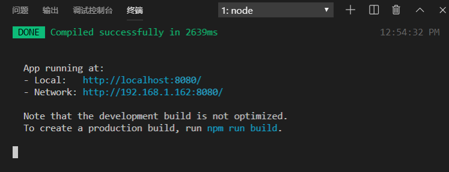

项目已经启动

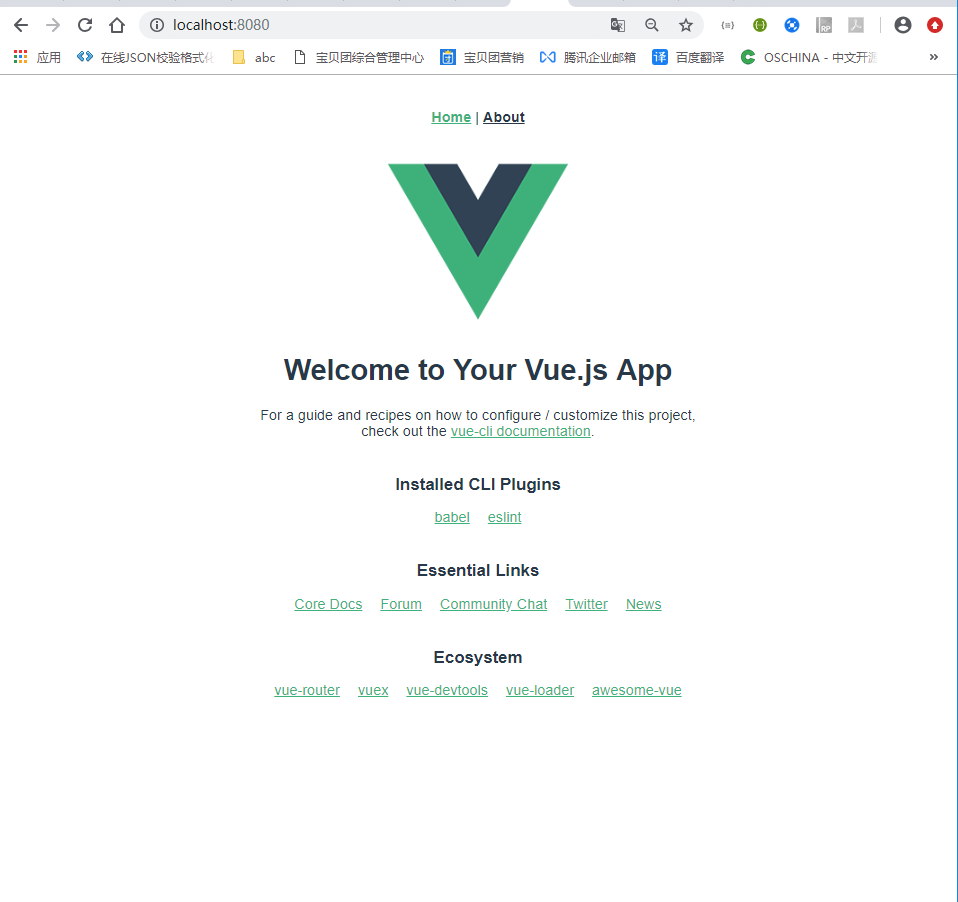

项目访问成功
# 项目启动命令
* npm方式启动
npm run serve
* yarn方式启动
yarn serve

# 常见问题
## VueCLI3如何更改安装时的包管理器为yarn或npm
[跳转博客园](https://www.cnblogs.com/saysmy/p/10064573.html)
## vue2.0 如何卸载
npm uninstall -g vue-cli
